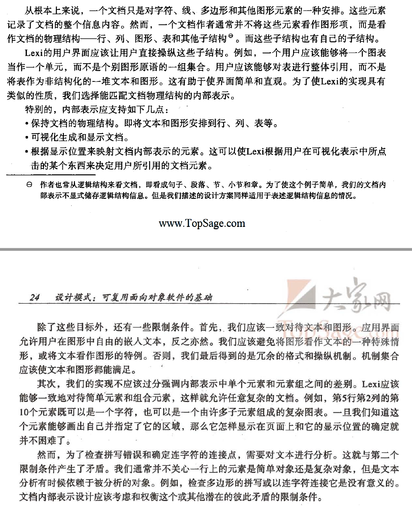
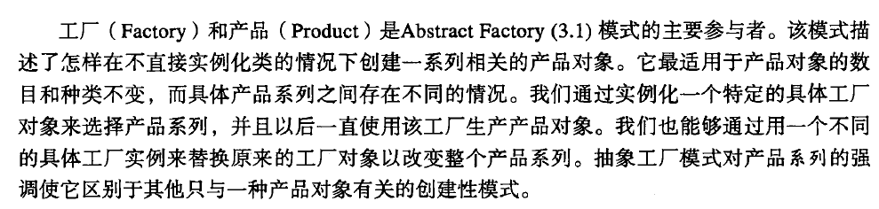
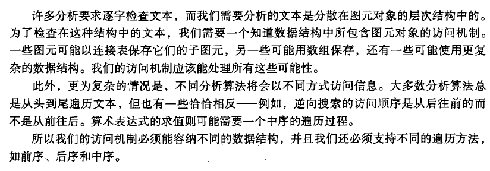

# 设计模式简述

## 23种设计模式简述

## 设计模式空间

## 设计模式之间的关系

## OMT表示法
page 10 (PDF 21)

***

# 设计模式实例

## 设计问题

## 文档结构

### 递归组合

### 图元

### 组合模式
递归组合不仅可以用来表示文档,还可以用它表示任何潜在的复杂的层次式的结构.Composite模式描述了面向对象的递归组合的本质.

## 格式化

### 封装格式化算法

### Compositor和Composition

### 策略模式

## 修饰用户界面

### 透明围栏

### MonoGlyph

### Decorator模式

## 支持多种视感标准

### 对象创建的抽象

### 工厂类和产品类

### Abstract Factory模式

## 支持多种窗口系统

### 是否可以使用AbstractFactory模式

### 封装实现依赖关系

### Window和WindowImp

### Bridge模式

## 用户操作

### 封装一个请求

### Command类及其子类

### 撤销和重做

### 命令历史记录

### Command模式

## 拼写检查和断字处理

### 访问分散的信息

